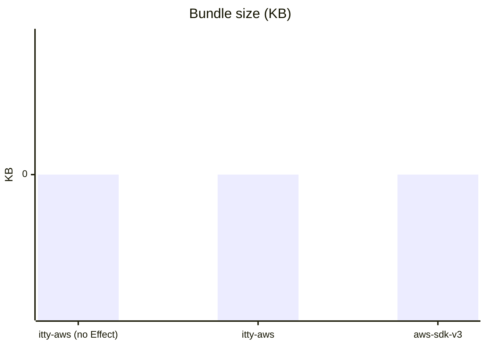

### Service-by-service comparison

| Service | itty-aws (KB) | vs v3 | itty-aws (no Effect, KB) | vs v3 | aws-sdk-v3 (KB) |
|---------|--------------:|--------:|--------------------------:|--------:|----------------:|
| S3      |        15     | ▼ -70%  |              9           | ▼ -84%  |            50   |
| EC2     |        18     | ▼ -65%  |             12           | ▼ -78%  |            52   |
| Dynamo  |        10     | ▼ -82%  |              6           | ▼ -89%  |            55   |
| …       |       …       |   …     |             …            |   …     |           …     |

**Avg Delta vs aws-sdk-v3**

- itty-aws: 
- itty-aws (no Effect): 

